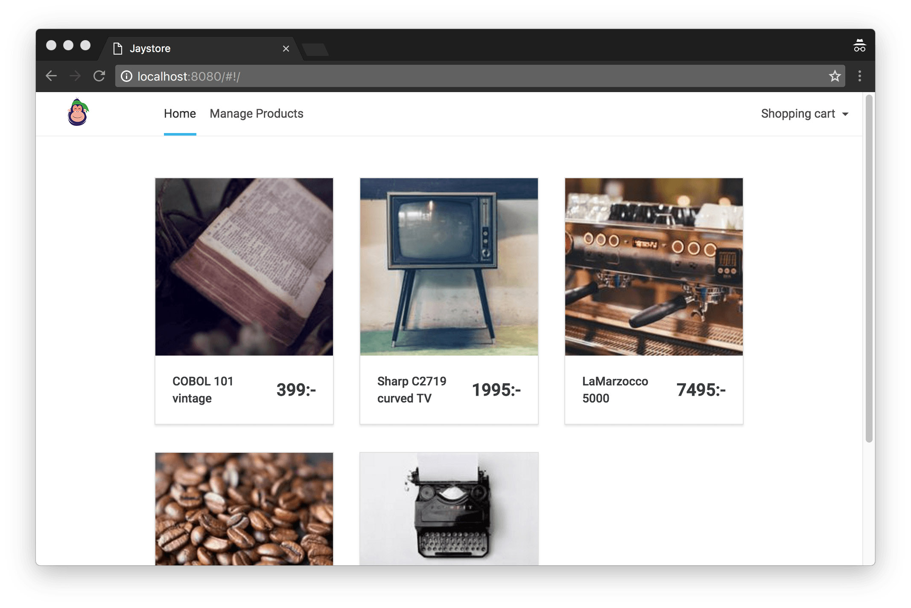
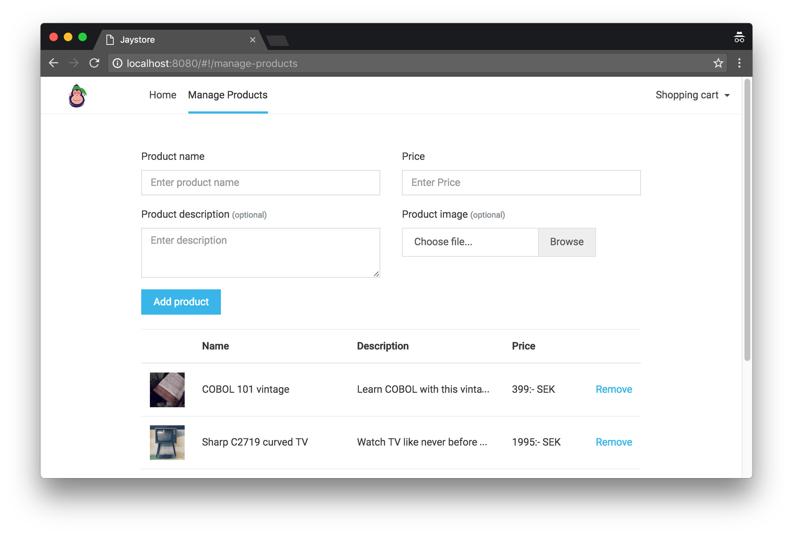

# Backend Task for Engineering Role

Thank you for showing an interest in joining us as a part of UX Gorilla Tech team.

Please read this document carefully. We've tried to be as specific as we could, but if you feel something is not clear in the task, feel free to raise a issue on Github and someone from our team should reply ASAP.

Please create a web app using any framework of your choice. (We use Vue internally, so using that will give you bonus points. That being said, Vue is an easy framework and you can learn that on-job).

The first page (see: product-catalog.jpg) should render the list of products from localStorage. 

The second page should contain a form to add products. The product list should be stored in the localStorage.

Image should be stored in the base64 format within the localstorage.

The code will be evaluated on the code quality and how close your output is to the design (Hint: You can use a lint to make it easier for yourself). Feel free to use any CSS Framework/Library.

For any queries, send an email to aman@uxgorilla.com

Happy Coding!
